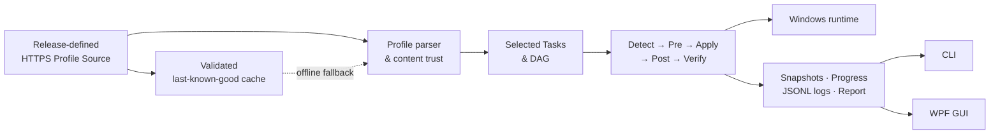

<div align="center">

# WDEM

### Declare your Windows development environment. Let the workflow do the rest.

一份 Profile，描述整台 Windows 开发工作站。<br>
WDEM 将软件、版本与配置步骤编排为可检查、可取消、可重试的 Task DAG。

[](https://www.microsoft.com/windows)
[](https://dotnet.microsoft.com/)
[](https://learn.microsoft.com/dotnet/desktop/wpf/)
[](LICENSE)

**Declarative Profiles · Task DAG · Workflow Pipeline · CLI + GUI**

</div>

---

## Why WDEM?

搭建开发环境不应该是一份会过期的安装清单，也不应该把每个软件硬编码进工具。

WDEM 把 Visual Studio、ReSharper、Git、.NET SDK 以及未来的任何工具都视为普通 Task。Profile 负责声明“需要什么”，Core 负责计算依赖和执行顺序，Windows Runtime 负责安全执行。新增软件、调整版本或增加安装后配置，通常只需修改 Profile。

| 传统安装脚本 | WDEM |
|---|---|
| 命令与流程耦合 | Profile 与执行引擎分离 |
| 不清楚本机是否已满足要求 | 启动后自动 Detect 并校验版本 |
| 手工维护执行顺序 | 根据依赖构建并验证 DAG |
| 取消后可能继续执行后续命令 | 停止当前进程树并阻断不安全的下游 |
| GUI 与 CLI 各写一套规则 | 两个入口共享同一 Core、状态与报告 |

## How it works



Task 的状态是执行事实的唯一来源。引擎先让 Task 进入合法状态，再执行对应 Activity；Activity 的结果继续驱动状态变化。GUI 只响应快照中的 `CanStart`、`CanCancel` 和 `CanSelect`，不复制工作流规则。

```text
Pending → Ready → Detecting → RunningPre → Applying → RunningPost → Verifying
                            ↘ Satisfied                         ↘ Succeeded
Running → Cancelling → Cancelled       dependency failure → Blocked
```

## Core capabilities

- **声明式 Profile** — 定义 Task 元数据、Required/Optional、依赖、来源、版本约束及阶段命令。
- **确定性 Task DAG** — 自动补齐依赖、去重、拓扑排序，并在执行前报告循环依赖。
- **完整生命周期** — 严格执行 `Detect → Pre → Apply → Post → Verify`；重试从 Detect 重新开始。
- **版本感知** — 支持精确版本、通配版本、最低版本和版本范围；低于最低版本时明确要求升级。
- **响应式控制** — 单个 Task 与整个计划均可开始或取消，按钮能力由 Core 状态投影产生。
- **安全取消** — 终止当前命令的完整进程树，停止新 Activity，并阻断依赖该 Task 的下游。
- **远程优先** — 发行版在代码中固定一个 HTTPS Source；网络故障时回退到已验证的最后一次有效缓存。
- **显式信任** — 远程或缓存 Profile 在运行 Detect/Apply 命令前，必须获得用户对当前内容哈希的确认。
- **统一体验** — WPF 与 CLI 共享 `Wdem.Core`、`Wdem.Windows`、进度模型和最终报告。
- **可追溯日志** — 每个 Session 写入独立 JSONL 日志，记录计划、阶段、stdout、stderr 与结果。

## A Profile is the product definition

下面的 Task 声明了最低版本、来源、检测方式、安装命令以及安装前后的配置。命令采用 executable + argument array，WDEM 不拼接 Shell 命令字符串。

```json
{
  "schemaVersion": 1,
  "id": "csharp-developer",
  "version": "1.0.0",
  "displayName": "C# Developer",
  "description": "A focused C# workstation profile",
  "tasks": {
    "git": {
      "displayName": "Git",
      "description": "Version control client",
      "required": true,
      "dependsOn": [],
      "version": ">= 2.50",
      "preferredVersion": "2.52.0",
      "source": "Git.Git",
      "detect": {
        "displayName": "Detect Git version",
        "executable": "git",
        "arguments": ["--version"],
        "versionPattern": "git version (?<version>\\d+(?:\\.\\d+)+)"
      },
      "pre": [
        {
          "displayName": "Prepare configuration",
          "executable": "powershell",
          "arguments": ["-NoProfile", "-File", "prepare-git.ps1"]
        }
      ],
      "apply": {
        "displayName": "Install Git with WinGet",
        "executable": "winget",
        "arguments": ["install", "--id", "{source}", "--exact", "--silent"]
      },
      "post": [
        {
          "displayName": "Apply team defaults",
          "executable": "powershell",
          "arguments": ["-NoProfile", "-File", "configure-git.ps1"]
        }
      ]
    }
  }
}
```

`source` 可表达 WinGet ID、URL、文件路径或企业源标识；`{source}` 与 `{preferredVersion}` 可用于参数。Schema 通过 `schemaVersion` 演进，新的执行机制则通过 `ITaskRuntime` adapter 扩展，Core 不认识具体软件。

完整约束见 [MVP 需求基线](docs/MVP_REQUIREMENTS.md)，模块边界与状态模型见 [架构说明](docs/ARCHITECTURE.md)。

## Get started

### GUI

从开始菜单启动 WDEM。应用会自动：

1. 从发行版固定的 Source 加载首个 Profile；
2. 请求确认当前 Profile 内容；
3. 检测本地环境并区分 Required 与 Optional Task；
4. 展示依赖、Pre/Post、目标版本、实时进度和详细输出；
5. 根据 Task 快照启用开始、取消与选择操作。

界面语言与安装时选择保持一致：English 安装显示完整英文界面，简体中文安装显示完整中文界面。

### CLI

```powershell
# 查看可用 Profile
wdem profiles

# 检查当前环境
wdem inspect --profile csharp-developer

# 应用 Required Task 和选中的 Optional Task
wdem apply --profile csharp-developer --select visual-studio,resharper

# 运行单个 Task 及其依赖
wdem apply --profile csharp-developer --task resharper

# 审查 Profile 后，用于非交互执行并允许一次重试
wdem apply --profile csharp-developer --yes --retries 1 --trust-profile
```

CLI 使用 `Ctrl+C` 安全取消。用户主动取消不会触发自动重试；已经满足版本约束的 Task 不会重复安装。

## Install

WDEM 提供 Windows x64 自包含安装程序，目标计算机无需预装 .NET SDK 或 .NET Desktop Runtime。

```text
WDEM-<version>-win-x64-setup.exe
```

安装程序支持简体中文和 English，可选择桌面快捷方式及把 `wdem.exe` 加入用户 PATH，并在 Windows“已安装的应用”中提供标准卸载入口。默认安装至：

```text
%LOCALAPPDATA%\Programs\WDEM
```

### Build the installer

需要 .NET 10 SDK 与 Inno Setup 6：

```powershell
pwsh .\build\Build-Installer.ps1 -Version 0.1.0
```

输出到 `artifacts/installer/`，同时生成 SHA-256 校验文件。安装包不会内置 `profiles/`。

## Security and recovery

| Concern | MVP guarantee |
|---|---|
| Profile transport | Source 与重定向只允许 HTTPS，单文档默认不超过 1 MiB |
| Command trust | Profile 内容首次出现或哈希变化后必须重新确认 |
| Process invocation | 参数通过 `ProcessStartInfo.ArgumentList` 传递 |
| Cancellation | Task 先进入 `Cancelling`，进程树退出后才进入 `Cancelled` |
| Downstream safety | 失败或取消会阻断依赖项，不影响无关 Task |
| Recovery | GUI 可重试失败计划，CLI 支持 `--retries N`；每次从 Detect 开始 |
| Cache integrity | 只有完成解析与校验的远程内容才会原子更新缓存 |
| Diagnostics | 日志默认保存至 `%LOCALAPPDATA%\Wdem\logs`，不可写时降级到 `%TEMP%\Wdem\logs` |

## Source and cache model

GUI 与 CLI 不提供 Source 编辑入口。每个发行版在代码中选择一个 HTTPS Profile Source；当前默认契约为：

```text
https://raw.githubusercontent.com/JasonLiCSHI/WDEM/main/profiles/
```

仓库中的 [`profiles/`](profiles/) 是该远程 Source 的发布内容，不会进入安装包。发布版本前必须确保目标分支已部署 `index.json` 与对应 Profile；如果远程内容尚未发布且本机没有有效缓存，应用不会执行任何 Profile 命令。

```text
%LOCALAPPDATA%\Wdem\cache\profiles    last-known-good cache
%LOCALAPPDATA%\Wdem\settings.json     content-hash trust records
%LOCALAPPDATA%\Wdem\logs              JSONL session logs
```

## MVP scope

当前版本刻意保持小而可靠：采用确定性的顺序 DAG 调度，不包含并行执行、自动 UAC 提升、回滚/卸载、重启续跑、Profile 市场、私有认证源或跨平台支持。这些能力可在现有 Profile、Graph、Workflow、Runtime seam 上继续演进，而无需向 Core 加入产品专用逻辑。

## Develop

```powershell
dotnet build Wdem.slnx
dotnet test Wdem.slnx
dotnet run --project src/Wdem.App/Wdem.App.csproj
dotnet run --project src/Wdem.Cli/Wdem.Cli.csproj -- profiles
```

| Project | Responsibility |
|---|---|
| `Wdem.Core` | Profile、版本约束、DAG、Workflow、状态快照与报告 |
| `Wdem.Windows` | Windows 进程执行、输出转发、进程树取消、缓存、信任与日志 |
| `Wdem.Cli` | 命令行交互、计划确认、重试与终端展示 |
| `Wdem.App` | WPF 工作台、本地化、Task 详情与响应式状态映射 |

请先阅读 [AGENTS.md](AGENTS.md) 了解产品边界与验证要求。

## License

WDEM is released under the [MIT License](LICENSE).
