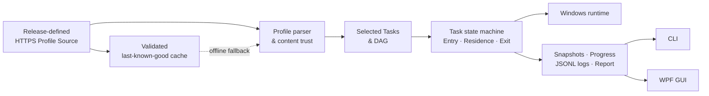

<div align="center">

<p><strong>English</strong> · <a href="./README.zh-CN.md">简体中文</a></p>

# WDEM

### One Profile is all you need.

Machines drift. Checklists rot. WDEM turns a Windows workstation into a declarative workflow.<br>
Describe the destination once; let the Task DAG take care of the journey.

**The north star: Terraform-grade planning and convergence with a Dev Box-grade experience for Windows workstations.**

[](https://www.microsoft.com/windows)
[](https://dotnet.microsoft.com/)
[](https://learn.microsoft.com/dotnet/desktop/wpf/)
[](https://github.com/JasonLiCSHI/WDEM/actions/workflows/ci.yml)
[](https://github.com/JasonLiCSHI/WDEM/releases/latest)
[](LICENSE)

**Profile says what · DAG decides when · Workflow knows how · Runtime executes safely**

<p>
  <a href="https://github.com/JasonLiCSHI/WDEM/releases/latest"><strong>Download WDEM</strong></a>
  · <a href="#a-profile-is-the-product-definition">Meet the Profile</a>
  · <a href="./docs/ARCHITECTURE.md">Read the architecture</a>
</p>

</div>

---

> Installers are imperative. Environments should be declarative.

## Stop babysitting installers

Setting up a development environment should not depend on an installation checklist that becomes obsolete, nor should every product be hard-coded into the manager.

WDEM treats Visual Studio, ReSharper, Git, the .NET SDK, and every future tool as ordinary Tasks—not special cases. A Profile declares what the workstation needs, Core computes dependencies and execution order, and the Windows Runtime executes each command safely. Adding software, changing a version, or introducing post-install configuration usually requires only a Profile change.

| Traditional installation scripts | WDEM |
|---|---|
| Commands and orchestration are coupled | Profiles are separate from the execution engine |
| Local compliance is unclear | Detect runs automatically and validates installed versions |
| Execution order is maintained manually | Dependencies form a validated DAG |
| Cancellation may leave downstream commands running | The active process tree is stopped and unsafe downstream work is blocked |
| GUI and CLI duplicate business rules | Both clients share the same Core, state, and reports |

## How it works

The short version: **Profile → Tasks → DAG → Workflow → a workstation you can explain.**



The Task state machine is the single source of execution truth. It enters a runtime state before running its Entry, Residence, and Exit Activities; Activity results select the next transition. Each runtime state projects a stable Task state into immutable snapshots. The GUI reacts only to the projected Task state and `CanStart`, `CanCancel`, and `CanSelect` capabilities; it does not duplicate workflow rules.

```text
Pending → Ready → Detecting → RunningPre → Applying → RunningPost → Verifying
                            ↘ Satisfied                         ↘ Succeeded
Running → Cancelling → Cancelled       dependency failure → Blocked
```

## Core capabilities

- **Declarative Profiles** — Define Task metadata, Required/Optional behavior, dependencies, sources, version requirements, and phase commands.
- **Dependency-aware Task DAG** — Expand dependency closure, reject cycles, run independent Tasks concurrently, and start dependents only after their prerequisites succeed.
- **Composable lifecycle** — Schema v1 compiles to `Detect → Pre → Apply → Post → Verify`; Schema v2 can declare an arbitrary bounded state graph with Entry, Residence, and Exit Activities.
- **Version awareness** — Support exact, wildcard, minimum, and range requirements, with an explicit upgrade state below the minimum version.
- **Reactive controls** — Start or cancel one Task or the entire plan; Core projects every available action from workflow state.
- **Safe cancellation** — Terminate the complete active process tree, prevent new Activities, and block Tasks that depend on the cancelled Task.
- **Remote-first Profiles** — Each release fixes one HTTPS Source in code and falls back to a validated last-known-good cache on network failure.
- **Explicit trust** — Remote and cached Profiles require approval for their current content hash before Detect or Apply can run commands.
- **One execution model** — WPF and CLI share `Wdem.Core`, `Wdem.Windows`, progress events, and final reports.
- **Traceable logs** — Each Session writes a dedicated JSONL log containing the plan, phases, stdout, stderr, and results.

## A Profile is the product definition

The Task below declares a minimum version, source, detection strategy, installation command, and pre/post configuration. Commands use an executable plus an argument array; WDEM never concatenates shell command strings.

```json
{
  "schemaVersion": 1,
  "id": "csharp-developer",
  "version": "1.0.0",
  "displayName": "C# Developer",
  "description": "A focused C# workstation profile",
  "tasks": {
    "git": {
      "displayName": "Git",
      "description": "Version control client",
      "required": true,
      "dependsOn": [],
      "version": ">= 2.50",
      "preferredVersion": "2.52.0",
      "source": "Git.Git",
      "detect": {
        "displayName": "Detect Git version",
        "executable": "git",
        "arguments": ["--version"],
        "versionPattern": "git version (?<version>\\d+(?:\\.\\d+)+)"
      },
      "pre": [
        {
          "displayName": "Prepare configuration",
          "executable": "powershell",
          "arguments": ["-NoProfile", "-File", "prepare-git.ps1"]
        }
      ],
      "apply": {
        "displayName": "Install Git with WinGet",
        "executable": "winget",
        "arguments": ["install", "--id", "{source}", "--exact", "--silent"]
      },
      "post": [
        {
          "displayName": "Apply team defaults",
          "executable": "powershell",
          "arguments": ["-NoProfile", "-File", "configure-git.ps1"]
        }
      ]
    }
  }
}
```

`source` may identify a WinGet package, URL, file path, or enterprise source. `{source}`, `{preferredVersion}`, and the installed runtime asset root `{appDirectory}` are available as argument placeholders. Schema v1 stays the compact choice for the standard lifecycle.

Schema v2 adds declarative state composition when a Task needs branching, recovery, or a non-standard lifecycle:

```json
{
  "schemaVersion": 2,
  "id": "custom-workflow",
  "version": "1.0.0",
  "displayName": "Custom workflow",
  "tasks": {
    "tool": {
      "displayName": "Tool",
      "required": true,
      "detect": { "executable": "tool", "arguments": ["--version"] },
      "apply": { "executable": "tool-installer", "arguments": ["install"] },
      "workflow": {
        "initialState": "configure",
        "maxTransitions": 20,
        "states": [
          {
            "id": "configure",
            "taskState": "Running",
            "entry": [
              { "id": "prepare", "phase": "prepare", "executable": "tool", "arguments": ["prepare"] }
            ],
            "residence": [
              { "id": "configure", "phase": "configure", "executable": "tool", "arguments": ["configure"] }
            ],
            "exit": [
              { "id": "cleanup", "phase": "cleanup", "executable": "tool", "arguments": ["cleanup"] }
            ],
            "transitions": [
              { "target": "done", "condition": "activitiesSucceeded" },
              { "target": "failed", "condition": "activitiesFailed" }
            ]
          },
          { "id": "done", "taskState": "Succeeded", "outcome": "Succeeded" },
          { "id": "failed", "taskState": "Failed", "outcome": "Failed" }
        ]
      }
    }
  }
}
```

Declarative transitions support `always`, `activitiesSucceeded`, `activitiesFailed`, `taskSatisfied`, and `taskNotSatisfied`. Code extensions can derive from `WorkflowActivity` and use custom transition predicates. `ITaskWorkflowProvider` selects or builds the state graph, while `ITaskRuntime` remains the execution adapter. The state graph is validated before execution and bounded by `maxTransitions`.

See the [MVP requirements](docs/MVP_REQUIREMENTS.md) for complete constraints and the [architecture guide](docs/ARCHITECTURE.md) for module boundaries and the state model.

## Get started

### GUI

Launch WDEM from the Start menu. The application automatically:

1. loads the first Profile from the release-defined Source;
2. asks the user to trust the current Profile content;
3. detects the local environment and separates Required from Optional Tasks;
4. presents dependencies, Pre/Post steps, target versions, live progress, and detailed output;
5. enables start, cancel, and selection actions from the latest Task snapshots.

The UI follows the language selected during installation. An English installation uses a fully English interface; a Simplified Chinese installation uses a fully Chinese interface.

### CLI

```powershell
# List available Profiles
wdem profiles

# Inspect the current environment
wdem inspect --profile csharp-developer

# Apply Required Tasks and selected Optional Tasks
wdem apply --profile csharp-developer --select visual-studio,resharper

# Run one Task and its dependency closure
wdem apply --profile csharp-developer --task resharper

# Run non-interactively after reviewing the Profile, with one retry
wdem apply --profile csharp-developer --yes --retries 1 --trust-profile
```

Use `Ctrl+C` to cancel safely. User cancellation never triggers an automatic retry, and a Task whose version requirement is already satisfied is not reinstalled.

## Install

WDEM ships as a self-contained Windows x64 installer. The target computer does not need the .NET SDK or .NET Desktop Runtime.

Download the installer and its SHA-256 checksum from the [latest GitHub Release](https://github.com/JasonLiCSHI/WDEM/releases/latest).

```text
WDEM-<version>-win-x64-setup.exe
```

The installer supports English and Simplified Chinese, optional desktop shortcuts, and adding `wdem.exe` to the user PATH. It installs the shared Task scripts and their versioned settings beside the GUI and CLI, and registers a standard uninstall entry in Windows Installed Apps. The default location is:

```text
%LOCALAPPDATA%\Programs\WDEM
```

WDEM must run with administrator privileges because environment Tasks install and configure machine-level software. Start the GUI with **Run as administrator**, or open an elevated Command Prompt, PowerShell, or Windows Terminal before using `wdem.exe`. Both clients refuse to load or execute Tasks from a non-elevated process.

### Build the installer

Install the .NET 10 SDK and Inno Setup 6, then run:

```powershell
pwsh .\build\Build-Installer.ps1 -Version 0.1.1
```

Output is written to `artifacts/installer/` together with a SHA-256 checksum. `script/` and `settings/` are included as runtime assets; the installer never bundles `profiles/`.

Maintainers publish a release by pushing a semantic version tag such as `v0.1.1`. GitHub Actions tests the solution, builds the release payload, and attaches the installer and checksum to the matching GitHub Release.

## Security and recovery

| Concern | MVP guarantee |
|---|---|
| Profile transport | Sources and redirects must use HTTPS; one document is limited to 1 MiB by default |
| Command trust | New Profile content, including any hash change, must be explicitly approved |
| Process invocation | Arguments are passed through `ProcessStartInfo.ArgumentList` |
| Cancellation | A Task enters `Cancelling` first and becomes `Cancelled` only after its process tree exits |
| Downstream safety | Failure or cancellation blocks dependents without affecting unrelated Tasks |
| Recovery | The GUI can retry a failed plan and the CLI accepts `--retries N`; each retry starts at Detect |
| Cache integrity | Only fully parsed and validated remote content atomically updates the cache |
| Diagnostics | JSONL logs include structured `user_action` entries, default to `%LOCALAPPDATA%\Wdem\logs`, and fall back to `%TEMP%\Wdem\logs` if needed |

## Source and cache model

The GUI and CLI do not expose Source editing. Each release selects one HTTPS Profile Source in code. The current default contract is:

```text
https://raw.githubusercontent.com/JasonLiCSHI/WDEM/main/profiles/
```

The repository [`profiles/`](profiles/) directory is the content published by that remote Source; it is not packaged in the installer. Before a release, `index.json` and its referenced Profiles must be deployed to the target branch. If the remote content has not been published and no valid cache exists, WDEM will not execute any Profile command.

### Replace the Profile Source

WDEM intentionally treats the Source as a release decision, not a user setting. To publish a build backed by another HTTPS host or GitHub repository:

1. Publish a directory containing `index.json` and every `<profile-id>.json` referenced by that index. Each document must be reachable with a direct HTTPS `GET` request.
2. In [`WdemUserSettingsStore.cs`](src/Wdem.Windows/Configuration/WdemUserSettingsStore.cs), change `OfficialSourceUrl` to that directory URL. Change `OfficialSourceId` to a new stable identifier when changing the source authority, and update the `WDEM Official` display name if appropriate.
3. Confirm the URL resolves as `<base-url>/index.json`, then run `dotnet test Wdem.slnx` and `dotnet build Wdem.slnx` before publishing a new installer.

The base URL may include a Git branch, tag, or release path and may be written with or without a trailing `/`; WDEM normalizes it. Prefer a protected branch for continuously delivered Profiles or an immutable tag for release-pinned Profiles. Cache directories are isolated by Source ID. Trust is bound to both the Source ID and the Profile content hash, so Profiles from a new Source—or modified command-bearing content—must be explicitly trusted before Detect or Apply can run commands.

```text
%LOCALAPPDATA%\Wdem\cache\profiles    last-known-good cache
%LOCALAPPDATA%\Wdem\settings.json     content-hash trust records
%LOCALAPPDATA%\Wdem\logs              JSONL session logs
```

## Roadmap: Terraform discipline, Dev Box experience

WDEM's destination is a Windows environment convergence engine: previewable and reproducible like Terraform, approachable and centrally distributable like Microsoft Dev Box. The comparison guides the product model; WDEM remains a local-first Windows tool, and software such as Visual Studio or ReSharper remains an ordinary declarative Task rather than a Core provider.

| Milestone | Outcome | Planned capabilities |
|---|---|---|
| **0.1.1 · Execution foundation** | A safe, observable local workflow | Trusted remote Profiles, Required/Optional selection, dependency-aware parallel DAG execution, composable Task state machines, process-tree cancellation, CLI/WPF parity, and JSONL audit logs |
| **0.2 · Plan before Apply** | Make every change reviewable | Immutable Plan model; `NoOp`, `Create`, `Upgrade`, `Reconfigure`, and `Blocked` changes; JSON export; GUI approval diff; Profile content fingerprint checked again at Apply |
| **0.3 · State and recovery** | Survive interruption without pretending cache is truth | Atomic desired/observed State, execution journal, state locking, restart/reboot continuation, read-only drift detection, and fresh Detect before every Plan or Apply |
| **0.4 · Reproducible Profiles** | Compose environments without copy-and-paste | Typed inputs, validated outputs and Task references, modules/includes, organization and user layers, source/version lock file with hashes, and explicit Schema migration |
| **0.5 · Extensible runtime** | Add installation mechanisms without product-specific Core logic | Generic executable, MSI/MSIX, archive/download, and WinGet adapters; timeouts, retry/backoff, reboot-required outcomes, concurrency limits, and exclusive resource locks |
| **0.6 · Team catalogs** | Bring the Dev Box self-service model to shared Windows setups | Git-backed signed Catalogs, approved publishers, organization policy, headless image/VM provisioning, compliance export, and optional Azure Dev Box integration outside Core |
| **1.0 · Trusted contract** | A stable base for personal and enterprise use | Profile/package trust chain, code-signed installer, SBOM, Credential Manager/Key Vault secret references, audit guarantees, and documented Schema compatibility policy |

The near-term order is deliberate: **Plan → execution journal and recovery → Profile composition and lock → runtime adapters → organization Catalog**. A marketplace, arbitrary remote plugins, full transactional rollback, a central fleet control plane, and cross-platform support stay out until these foundations are dependable.

## MVP scope

The current release is intentionally small and dependable. Its dependency-aware DAG scheduler runs independent Tasks concurrently while preserving dependency and per-Task Activity order. It does not yet include automatic UAC elevation, rollback or uninstall, resume after restart, a Profile marketplace, authenticated private sources, or cross-platform support. Those capabilities can evolve on the existing Profile, Graph, Workflow, and Runtime seams without adding product-specific logic to Core.

## Develop

```powershell
dotnet build Wdem.slnx
dotnet test Wdem.slnx
dotnet run --project src/Wdem.App/Wdem.App.csproj
dotnet run --project src/Wdem.Cli/Wdem.Cli.csproj -- profiles
```

| Project | Responsibility |
|---|---|
| `Wdem.Core` | Profiles, version requirements, DAG construction, Workflow state, snapshots, and reports |
| `Wdem.Windows` | Windows process execution, output forwarding, process-tree cancellation, cache, trust, and logs |
| `Wdem.Cli` | Command-line interaction, plan confirmation, retries, and terminal presentation |
| `Wdem.App` | Localized WPF workbench, Task details, and reactive state projection |

### Built-in Agent Skill

WDEM ships its contributor contract as an [Agent Skill](.agents/skills/wdem-development/SKILL.md), so coding agents can understand the architecture before changing it instead of rediscovering the rules in every session.

| Agent | Discovery entry point |
|---|---|
| Codex | [`.agents/skills/wdem-development`](.agents/skills/wdem-development/SKILL.md) |
| Claude Code | [`.claude/skills/wdem-development`](.claude/skills/wdem-development/SKILL.md) |
| GitHub Copilot | [`.github/skills/wdem-development`](.github/skills/wdem-development/SKILL.md) |

The Skill covers layer ownership, Profile and Workflow semantics, safe process-tree cancellation, administrator requirements, installer diagnostics, validation, packaging, and release discipline. All discovery entry points resolve to the canonical `.agents/skills/` copy, keeping the guidance consistent across agents. Its [evaluation set](.agents/skills/wdem-development/evals/evals.json) exercises installer failure recovery, declarative Task additions, and reactive UI state handling.

Read [AGENTS.md](AGENTS.md) before contributing to understand the product boundaries and validation requirements.

## License

WDEM is licensed under the [Apache License 2.0](LICENSE).
Copyright © 2026 Jason Li.
