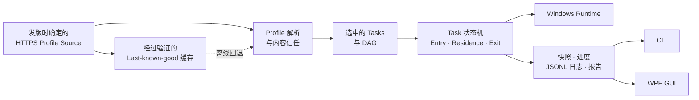

<div align="center">

<p><a href="./README.md">English</a> · <strong>简体中文</strong></p>

# WDEM

### 一个 Profile，就够了。

机器会漂移，清单会过期。WDEM 把 Windows 开发环境变成声明式工作流。<br>
你只需描述终点，Task DAG 会安排好抵达那里的每一步。

**最终目标：为 Windows 工作站提供 Terraform 级的计划与收敛能力，以及 Dev Box 级的使用体验。**

[](https://www.microsoft.com/windows)
[](https://dotnet.microsoft.com/)
[](https://learn.microsoft.com/dotnet/desktop/wpf/)
[](https://github.com/JasonLiCSHI/WDEM/actions/workflows/ci.yml)
[](https://github.com/JasonLiCSHI/WDEM/releases/latest)
[](LICENSE)

**Profile 说明要什么 · DAG 决定先后 · Workflow 负责怎么做 · Runtime 保证安全执行**

<p>
  <a href="https://github.com/JasonLiCSHI/WDEM/releases/latest"><strong>下载 WDEM</strong></a>
  · <a href="#profile-就是产品定义">认识 Profile</a>
  · <a href="./docs/ARCHITECTURE.md">阅读架构文档</a>
</p>

</div>

---

> 安装程序是命令式的，环境应该是声明式的。

## 不再盯着安装程序发呆

搭建开发环境不该依赖一份注定过期的安装清单，也不该把每个软件都硬编码进管理器。

在 WDEM 眼里，Visual Studio、ReSharper、Git、.NET SDK，以及未来加入的任何工具，都只是普通 Task，而不是特殊分支。Profile 声明工作站需要什么，Core 计算依赖和执行顺序，Windows Runtime 安全执行命令。增加软件、调整版本、添加安装后配置，通常只需要修改 Profile。

| 传统安装脚本 | WDEM |
|---|---|
| 命令与编排紧密耦合 | Profile 与执行引擎分离 |
| 本地环境是否合规并不清楚 | 启动时自动 Detect 并验证版本 |
| 人工维护安装顺序 | 依赖组成经过验证的 DAG |
| 取消可能遗留进程并继续执行 | 停止整个进程树并阻断不安全的下游 Task |
| GUI 和 CLI 各写一套业务规则 | 两端共享相同 Core、状态与报告 |

## 它如何工作

一句话版本：**Profile → Tasks → DAG → Workflow → 一台说得清楚的工作站。**



Task 状态机是执行事实的唯一来源。Runtime 进入一个状态后，依次执行该状态的 Entry、Residence 和 Exit Activities，再由 Activity 结果选择下一条转换。每个 Runtime 状态都会映射为稳定的 Task 状态并发布不可变快照。GUI 只响应 Task 状态以及 `CanStart`、`CanCancel`、`CanSelect` 能力，不解释、更不会复制 Workflow 规则。

```text
Pending → Ready → Detecting → RunningPre → Applying → RunningPost → Verifying
                            ↘ Satisfied                         ↘ Succeeded
Running → Cancelling → Cancelled       dependency failure → Blocked
```

## 核心能力

- **声明式 Profile** — 定义 Task 元数据、必选/可选、依赖、来源、版本要求和阶段命令。
- **依赖感知的 Task DAG** — 展开依赖闭包、拒绝环、并发运行独立 Task，并只在全部前置任务成功后启动下游。
- **可组合生命周期** — Schema v1 编译为 `Detect → Pre → Apply → Post → Verify`；Schema v2 可声明带 Entry、Residence、Exit Activities 的有界状态图。
- **版本感知** — 支持精确版本、通配符、最低版本和版本范围；低于最低版本时明确标记为必须升级。
- **响应式操作能力** — 单独或整体启动、取消 Task；所有可用操作都由 Core 根据 Workflow 状态投影。
- **安全取消** — 终止完整活动进程树、阻止新 Activity 启动，并阻断依赖已取消 Task 的下游任务。
- **远程优先 Profile** — 每次发版在代码中固定一个 HTTPS Source；网络失败时回退到经过验证的 last-known-good 缓存。
- **显式信任** — 远程和缓存 Profile 必须按当前内容哈希获得用户批准，才能通过 Detect 或 Apply 执行命令。
- **统一执行模型** — WPF 与 CLI 共享 `Wdem.Core`、`Wdem.Windows`、进度事件和最终报告。
- **完整可追踪日志** — 每个 Session 都有独立 JSONL 日志，记录计划、阶段、stdout、stderr 和结果。

## Profile 就是产品定义

下面这个 Task 同时声明了最低版本、来源、检测策略、安装命令，以及安装前后的配置。命令由可执行文件和参数数组组成；WDEM 从不拼接 Shell 命令字符串。

```json
{
  "schemaVersion": 1,
  "id": "csharp-developer",
  "version": "1.0.0",
  "displayName": "C# Developer",
  "description": "A focused C# workstation profile",
  "tasks": {
    "git": {
      "displayName": "Git",
      "description": "Version control client",
      "required": true,
      "dependsOn": [],
      "version": ">= 2.50",
      "preferredVersion": "2.52.0",
      "source": "Git.Git",
      "detect": {
        "displayName": "Detect Git version",
        "executable": "git",
        "arguments": ["--version"],
        "versionPattern": "git version (?<version>\\d+(?:\\.\\d+)+)"
      },
      "pre": [
        {
          "displayName": "Prepare configuration",
          "executable": "powershell",
          "arguments": ["-NoProfile", "-File", "prepare-git.ps1"]
        }
      ],
      "apply": {
        "displayName": "Install Git with WinGet",
        "executable": "winget",
        "arguments": ["install", "--id", "{source}", "--exact", "--silent"]
      },
      "post": [
        {
          "displayName": "Apply team defaults",
          "executable": "powershell",
          "arguments": ["-NoProfile", "-File", "configure-git.ps1"]
        }
      ]
    }
  }
}
```

`source` 可以表示 WinGet 包、URL、文件路径或企业源。参数中可以使用 `{source}`、`{preferredVersion}`，以及指向已安装运行时资源根目录的 `{appDirectory}` 占位符。对于标准生命周期，Schema v1 依然是最简洁的选择。

当 Task 需要分支、恢复或非标准生命周期时，Schema v2 可以声明组合状态流：

```json
{
  "schemaVersion": 2,
  "id": "custom-workflow",
  "version": "1.0.0",
  "displayName": "Custom workflow",
  "tasks": {
    "tool": {
      "displayName": "Tool",
      "required": true,
      "detect": { "executable": "tool", "arguments": ["--version"] },
      "apply": { "executable": "tool-installer", "arguments": ["install"] },
      "workflow": {
        "initialState": "configure",
        "maxTransitions": 20,
        "states": [
          {
            "id": "configure",
            "taskState": "Running",
            "entry": [
              { "id": "prepare", "phase": "prepare", "executable": "tool", "arguments": ["prepare"] }
            ],
            "residence": [
              { "id": "configure", "phase": "configure", "executable": "tool", "arguments": ["configure"] }
            ],
            "exit": [
              { "id": "cleanup", "phase": "cleanup", "executable": "tool", "arguments": ["cleanup"] }
            ],
            "transitions": [
              { "target": "done", "condition": "activitiesSucceeded" },
              { "target": "failed", "condition": "activitiesFailed" }
            ]
          },
          { "id": "done", "taskState": "Succeeded", "outcome": "Succeeded" },
          { "id": "failed", "taskState": "Failed", "outcome": "Failed" }
        ]
      }
    }
  }
}
```

声明式转换支持 `always`、`activitiesSucceeded`、`activitiesFailed`、`taskSatisfied` 和 `taskNotSatisfied`。代码扩展可以继承 `WorkflowActivity` 并使用自定义转换谓词。`ITaskWorkflowProvider` 选择或构建状态图，`ITaskRuntime` 继续充当执行适配器。状态图会在执行前验证，并受 `maxTransitions` 限制。

完整约束请参阅 [MVP 需求](docs/MVP_REQUIREMENTS.md)，模块边界与状态模型请参阅[架构指南](docs/ARCHITECTURE.md)。

## 快速开始

### GUI

从开始菜单启动 WDEM。应用会自动：

1. 从发版时确定的 Source 加载第一个 Profile；
2. 请求用户信任当前 Profile 内容；
3. 检测本地环境，并分开显示必选与可选 Tasks；
4. 展示依赖、Pre/Post 步骤、目标版本、实时进度和详细输出；
5. 根据最新 Task 快照启用启动、取消和选择操作。

UI 会跟随安装时选择的语言。英文安装提供完整英文界面，简体中文安装提供完整中文界面。

### CLI

```powershell
# 列出可用 Profile
wdem profiles

# 检查当前环境
wdem inspect --profile csharp-developer

# 执行必选 Task 和选中的可选 Task
wdem apply --profile csharp-developer --select visual-studio,resharper

# 执行一个 Task 及其依赖闭包
wdem apply --profile csharp-developer --task resharper

# 审阅 Profile 后非交互执行，失败时重试一次
wdem apply --profile csharp-developer --yes --retries 1 --trust-profile
```

使用 `Ctrl+C` 安全取消。用户取消不会触发自动重试，已经满足版本要求的 Task 也不会重复安装。

## 安装

WDEM 以 Windows x64 自包含安装程序发布，目标电脑无需安装 .NET SDK 或 .NET Desktop Runtime。

从 [GitHub 最新 Release](https://github.com/JasonLiCSHI/WDEM/releases/latest)下载安装程序及 SHA-256 校验文件。

```text
WDEM-<version>-win-x64-setup.exe
```

安装程序支持英文和简体中文，可选创建桌面快捷方式并将 `wdem.exe` 加入用户 PATH。共享 Task 脚本及其版本化设置会与 GUI、CLI 一同安装，同时在 Windows“已安装的应用”中注册标准卸载项。默认安装位置：

```text
%LOCALAPPDATA%\Programs\WDEM
```

环境 Task 会安装和配置计算机级软件，因此 WDEM 必须以管理员权限运行。请右键单击 GUI 并选择**以管理员身份运行**，或者先打开管理员权限的命令提示符、PowerShell 或 Windows Terminal，再运行 `wdem.exe`。GUI 和 CLI 在非管理员进程中都不会加载或执行 Task。

### 构建安装程序

安装 .NET 10 SDK 和 Inno Setup 6，然后运行：

```powershell
pwsh .\build\Build-Installer.ps1 -Version 0.1.1
```

产物及其 SHA-256 校验文件会写入 `artifacts/installer/`。`script/` 和 `settings/` 会作为运行时资源打包；安装程序永远不会捆绑 `profiles/`。

维护者可以通过推送 `v0.1.1` 这样的语义版本标签发布新版本。GitHub Actions 会测试解决方案、构建发布产物，并将安装程序和校验文件附加到对应 GitHub Release。

## 安全与恢复

| 关注点 | MVP 保证 |
|---|---|
| Profile 传输 | Source 与重定向必须使用 HTTPS；单个文档默认限制为 1 MiB |
| 命令信任 | 新 Profile 内容以及任何哈希变化都必须获得显式批准 |
| 进程调用 | 参数通过 `ProcessStartInfo.ArgumentList` 传递 |
| 取消 | Task 先进入 `Cancelling`，仅在进程树退出后变为 `Cancelled` |
| 下游安全 | 失败或取消会阻断依赖项，但不影响无关 Task |
| 恢复 | GUI 可以重试失败计划，CLI 支持 `--retries N`；每次重试都从 Detect 开始 |
| 缓存完整性 | 只有完整解析并验证成功的远程内容才能原子更新缓存 |
| 诊断 | JSONL 日志包含结构化的 `user_action` 操作记录，默认保存到 `%LOCALAPPDATA%\Wdem\logs`，失败时回退到 `%TEMP%\Wdem\logs` |

## Source 与缓存模型

GUI 和 CLI 不提供 Source 编辑。每个 Release 在代码中选择一个 HTTPS Profile Source。当前默认约定是：

```text
https://raw.githubusercontent.com/JasonLiCSHI/WDEM/main/profiles/
```

仓库中的 [`profiles/`](profiles/) 是该远程 Source 发布的内容，不会打进安装包。发布前必须把 `index.json` 及其引用的 Profiles 部署到目标分支。如果远程内容尚未发布并且不存在有效缓存，WDEM 不会执行任何 Profile 命令。

### 替换 Profile Source

WDEM 刻意将 Source 作为发版决策，而不是用户设置。若要发布使用其他 HTTPS 主机或 GitHub 仓库的版本：

1. 发布一个包含 `index.json` 以及该索引引用的所有 `<profile-id>.json` 的目录；每个文件都必须能够通过直接的 HTTPS `GET` 请求访问。
2. 在 [`WdemUserSettingsStore.cs`](src/Wdem.Windows/Configuration/WdemUserSettingsStore.cs) 中，把 `OfficialSourceUrl` 改为该目录的 URL。切换 Source 的管理方时，应将 `OfficialSourceId` 改为一个新的、稳定的标识符；如有需要，也应更新 `WDEM Official` 显示名称。
3. 确认 `<base-url>/index.json` 可以访问，然后在发布新安装包前运行 `dotnet test Wdem.slnx` 和 `dotnet build Wdem.slnx`。

Base URL 可以指向 Git 分支、Tag 或 Release 路径，末尾是否带 `/` 均可，WDEM 会自动规范化。持续交付 Profile 时建议使用受保护分支；需要让 Profile 与软件版本严格绑定时建议使用不可变 Tag。缓存按 Source ID 隔离；信任同时绑定 Source ID 与 Profile 内容哈希，因此来自新 Source 的 Profile 或命令内容发生变化的 Profile，都必须先由用户明确授权，Detect 或 Apply 才能执行命令。

```text
%LOCALAPPDATA%\Wdem\cache\profiles    last-known-good 缓存
%LOCALAPPDATA%\Wdem\settings.json     内容哈希信任记录
%LOCALAPPDATA%\Wdem\logs              JSONL Session 日志
```

## 路线图：Terraform 的严谨，Dev Box 的体验

WDEM 的目标是成为 Windows 环境收敛引擎：像 Terraform 一样可预览、可复现，像 Microsoft Dev Box 一样易于使用和集中分发。这个类比用于指导产品模型；WDEM 仍然以本地 Windows 为中心，Visual Studio、ReSharper 等软件始终只是普通声明式 Task，而不是 Core 中的专用 Provider。

| 里程碑 | 结果 | 计划能力 |
|---|---|---|
| **0.1.1 · 执行基础** | 安全且可观测的本地 Workflow | 可信远程 Profile、必选/可选 Task、依赖感知的并行 DAG、可组合 Task 状态机、进程树安全取消、CLI/WPF 一致行为和 JSONL 审计日志 |
| **0.2 · Apply 前先 Plan** | 每次变更都可审阅 | 不可变 Plan 模型；`NoOp`、`Create`、`Upgrade`、`Reconfigure`、`Blocked` 变更；JSON 导出；GUI 差异确认；Apply 时再次校验 Profile 内容指纹 |
| **0.3 · State 与恢复** | 中断后可继续，但绝不把缓存当成机器真相 | 原子保存 Desired/Observed State、执行 Journal、State 锁、重启/重启系统后续跑、只读漂移检测，以及每次 Plan/Apply 前重新 Detect |
| **0.4 · 可复现 Profile** | 无需复制粘贴即可组合环境 | 类型化输入、经过验证的输出与 Task 引用、modules/includes、组织层与用户层、带哈希的来源/版本锁文件，以及明确的 Schema 迁移 |
| **0.5 · 可扩展 Runtime** | 无需污染 Core 即可增加安装机制 | 通用 Executable、MSI/MSIX、Archive/Download、WinGet Adapter；超时、重试/退避、需要重启结果、并发限制和独占资源锁 |
| **0.6 · 团队 Catalog** | 将 Dev Box 的自助模式带到共享 Windows 环境 | Git-backed 签名 Catalog、批准发布者、组织策略、无界面镜像/VM 配置、合规导出，以及位于 Core 之外的可选 Azure Dev Box 集成 |
| **1.0 · 可信契约** | 面向个人和企业的稳定基础 | Profile/Package 信任链、安装包代码签名、SBOM、Credential Manager/Key Vault Secret 引用、审计保证和明确的 Schema 兼容策略 |

近期顺序是有意设计的：**Plan → 执行 Journal 与恢复 → Profile 组合与锁 → Runtime Adapter → 组织 Catalog**。Marketplace、任意远程插件、完整事务回滚、中央设备控制面和跨平台支持，要等这些基础足够可靠后再考虑。

## MVP 边界

当前版本刻意保持小而可靠。依赖感知的 DAG 调度器会并发运行彼此独立的 Task，同时严格保持依赖顺序和单个 Task 内的 Activity 顺序。当前暂不包含自动 UAC 提权、回滚或卸载、重启后续跑、Profile 市场、带身份认证的私有 Source，以及跨平台支持。这些能力未来可以沿现有 Profile、Graph、Workflow 和 Runtime 扩展点演进，无需把产品专用逻辑放进 Core。

## 开发

```powershell
dotnet build Wdem.slnx
dotnet test Wdem.slnx
dotnet run --project src/Wdem.App/Wdem.App.csproj
dotnet run --project src/Wdem.Cli/Wdem.Cli.csproj -- profiles
```

| 项目 | 职责 |
|---|---|
| `Wdem.Core` | Profile、版本要求、DAG 构建、Workflow 状态、快照和报告 |
| `Wdem.Windows` | Windows 进程执行、输出转发、进程树取消、缓存、信任和日志 |
| `Wdem.Cli` | 命令行交互、计划确认、重试和终端展示 |
| `Wdem.App` | 本地化 WPF 工作台、Task 详情和响应式状态投影 |

### 内置 Agent Skill

WDEM 将贡献规范作为 [Agent Skill](.agents/skills/wdem-development/SKILL.md) 随仓库提供，让编码 Agent 在修改代码前直接理解架构，不必在每次会话中重新推断规则。

| Agent | 自动发现入口 |
|---|---|
| Codex | [`.agents/skills/wdem-development`](.agents/skills/wdem-development/SKILL.md) |
| Claude Code | [`.claude/skills/wdem-development`](.claude/skills/wdem-development/SKILL.md) |
| GitHub Copilot | [`.github/skills/wdem-development`](.github/skills/wdem-development/SKILL.md) |

该 Skill 覆盖分层职责、Profile 与 Workflow 语义、安全终止进程树、管理员权限、安装器诊断、验证、打包和发布纪律。所有发现入口最终指向 `.agents/skills/` 中的唯一规范正文，保证不同 Agent 获得一致指导。[评估用例](.agents/skills/wdem-development/evals/evals.json)则覆盖安装器故障恢复、声明式 Task 扩展和响应式 UI 状态联动。

贡献前请阅读 [AGENTS.md](AGENTS.md)，了解产品边界和验证要求。

## 许可证

WDEM 采用 [Apache License 2.0](LICENSE) 开源许可证。
版权所有 © 2026 Jason Li。
